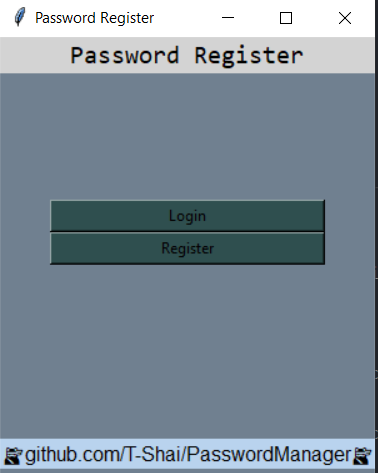

# Password Manager
A simple offline password manager in python using **symmetric encryption** (Fernet see requirements.txt) and **tkinter**

[]

## How does it work ?
- Create an account with the register button *(the credentials are stored on your computer ofc the password is encrypted)*
- Login into your account
- Create a new password, you need to provide :
    - website name or url *(any custom name as far you can remember)*
    - username *(you can have multiple username for the same website but you can't have the same username for the same website with a different password)*
    - password *(You can enter it yourself or click on generate password to get a really strong password)*
- Now you can see / delete / modify your password

## known issues
- modifying password appends characters to the password
- selecting a deleted password causes an error *(close and reopen screen)*
